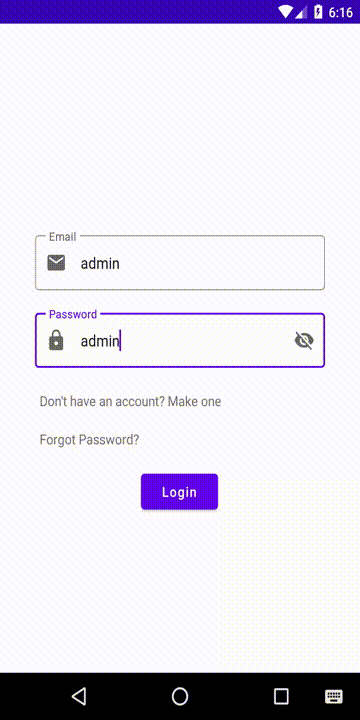

# Online Shop Project

 My final project for *Advanced Programming* (AP) lesson at AUT.

 A simple online shop that users can add posters to sell their items and also observe other users posters.

## Details

 - Professor : Dr. Saeed Shiri

 - Student : Ilya Khalafi

 - Project title : Online Shop

## Setup

 - Import *shop_db* database from folder :
> MySQL Database

 - Input *username* and *password* of your mysql server to :
> Spring Server/demo/src/main/resources/application.properties

 - Input *GMAIL_ADDRESS* and *GMAIL_PASSWORD* in file :
> Spring Server\demo\src\main\java\com\example\demo\service\EmailService.java

 - Run server from folder :
 > Spring Server

 - Input *server_ip* of the machine that you ran server on, to the file in path :
 > Android App/OnlineShop/app/src/main/res/values/strings.xml

 - Run application from folder :
 > Android App

 |  |  |
 | :-: | :-: |
 | User View | Admin Panel |

## Predefined users

| Email | Password | User Type |
| :-: | :-: | :-: |
| admin | admin | *ADMIN* |
| person1@ilyashop.com | 1234 | *USER* |
| person2@ilyashop.com | 1234 | *USER* |
| person3@ilyashop.com | 1234 | *USER* |
| person4@ilyashop.com | 1234 | *USER* |
| person5@ilyashop.com | 1234 | *USER* |

 ## Features

 - Backend with Spring boot and hibernate

   - All CRUD operations are set for posters and users

   - Server makes confirmation token to confirm users after signup

   - Server send confirmation token to users email using gmail smtp service

   - Confirmation tokens expire after 15 minutes

 - *ObjectBox*, a NoSQL database, is used on client side

   - Client side database keeps posters and bookmarks of user for offline usage

   - *Repository* class syncs local database with server

 - Admin panel is implemented and all CRUD operation are accessible for admin through admin panel

   - Admin also can see users logs which contains login, adding, removing and updating posters

   - Admin also is capable of increasing and decreasing posters priority, so when users search for a poster, poster with higher priority will be shown first

 - Users can **bookmark** other users posters so they can easily find posters later

   - Users cannot bookmark their own posters but their posters are accessible through *my poster* in navigation drawer

 - All search bars, including search bars in admin panel, have lazy loading ability.

   - Lazy loading is implemented using JPA Paging and Sorting on server side
